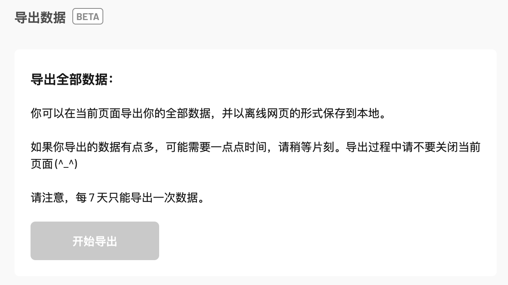

## Open-flomo

Open-flomo，公开你的flomo，一个公开样式模板

- 作为INFP，我并不擅长公开表达
- 事实上，我的flomo没什么宝藏，没什么不可见的，女朋友看完了我也没有被她看我日记的那种羞耻
- 我不擅长使用 flomo，标签/分类/Workflow 都不会用。我的 flomo 仅仅是一个速记工具，很杂乱
- 如果我不把他公开，绝大多数信息永远都不会被看到；反而如果被看到，可能对人的了解有更多
- 而有人味的东西，是越来越少了

---
### 描述

- [Example Site：openflomo.kkuk.dev](https://openflomo.kkuk.dev) 
- [My Open flomo：flomo.kkuk.dev](https://flomo.kkuk.dev) 
- 由 O3mini + Claude3.5 操刀，最原始的 Html+Css+Js文件
- 如果你只想展示部分时间、部分标签，你可以选择不上传、或者在 `config.js` 中进行配置
- 通过 Github Page 部署站点，数据、域名都由你自己掌控

---
### 🌟How to use

#### 1.导出你的flomo内容


Notes：
- 根据官方信息，每7天只可以导出一次；简单挣扎后，放弃了其他可能实时更新的方案
- 如果你有不想公开的部分，可以在导出的时候提前筛选标签

#### 2.Clone这个仓库
```bash
git clone https://github.com/feng6611/Open-flomo.git
```

#### 3.将解压后的flomo文件夹，导入并替换当前项目

#### 4.配置项更新
- `notesFileUrl: "flomo/memos.html"`：更新你实际的flomo文件路径
- `minDate: "2024-01-01"`：仅显示该时间之后的memos

#### 5.创建并提交代码，开启 Github Page
```bash
git add .
git commit -m "init open-flomo"
git push
```
进入仓库 Settings → Pages → 选择分支和`/root`路径

---
### 📁 项目结构

```
Open-flomo/
├── assets/           # 静态资源文件夹
│   └── images/      # 图片资源
├── flomo/           # flomo导出文件
├── index.html       # 主页面
├── config.js        # 配置文件
└── main.js          # 主要逻辑
```

---
### 📮 About Me

- 微信：fchen6611
- 邮箱：fchen6611@gmail.com